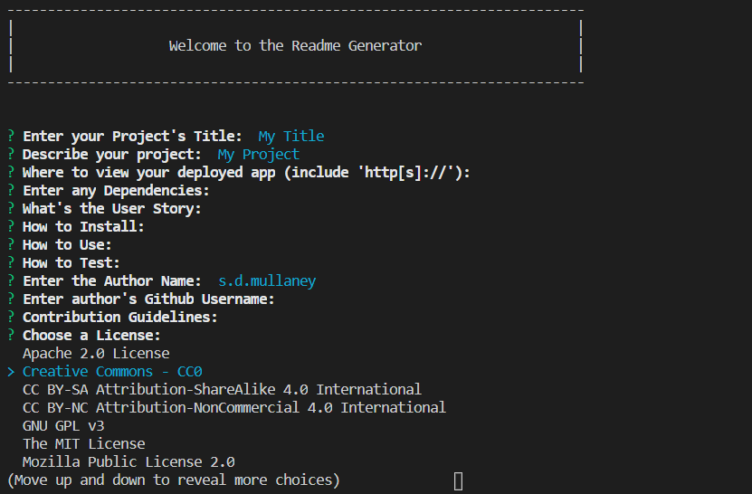

# Professional README Generator
## Table of Contents
1. [Description](#description)
2. [Deployed Link](#deployed)
3. [Dependencies](#depends)
4. [User Story](#userstory)
5. [How To Use](#usage)
6. [Authors](#author)
7. [License](#license)

----------------
## Description

This CLI application uses the Inquirer NPM package to create a formatted markdown README file based on user input.

----------------
## Demonstration

https://www.youtube.com/watch?v=pg_b2M8LsCI

----------------
## Dependencies

Node.js, Inquirer NPM package

----------------
## User Story

As a web developer, I want an easy way to create professional README files that are formatted.

----------------
## How to Use

Watch the video linked above for a demonstration of how to use this.

----------------
## Author(s)

s.d.mullaney. View me [seagda](https://github.com/seagda) on Github.

----------------
## License

[Creative Commons - CC0](http://creativecommons.org/publicdomain/zero/1.0/)
